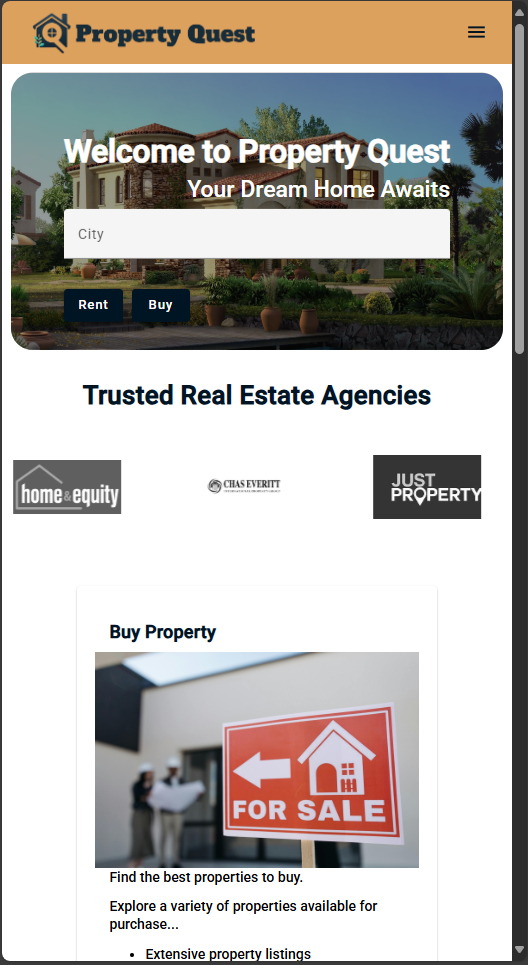

# 🏡 PropertyQuest — Real Estate Platform

**PropertyQuest** is a modern, responsive real estate platform built with **Angular**. The platform enables users to explore properties available for **rent** or **buy** in various cities. The focus is on performance, intuitive navigation, and clean design to ensure a seamless property search experience.

---

## 🚀 Features

- 🔍 **Search** properties by type (`Rent` or `Buy`) or directly by city.
- 📱 Fully **responsive design** — smooth experience on mobile, tablet, and desktop.
- ⚡ Dynamic **filtering** and flexible search logic.
- 🏷️ **Minimal and clean UI** with user-friendly navigation.
- 💡 Organized Angular project structure for easy scaling and maintenance.

---

## 🧑‍💻 Tech Stack

| Technology         | Description                               |
|---------------------|-------------------------------------------|
| Angular             | Front-end framework                       |
| TypeScript          | Type-safe JavaScript                      |
| SCSS                | Modular and responsive custom styling     |
| RxJS                | Reactive programming and data streams     |
| Angular CLI         | Build, serve, and scaffold tooling        |

---

## 📸 Screenshots

| View on Desktop                     | View on Mobile                    |
|-------------------------------------|-----------------------------------|
|  |  |


---

## ⚙️ Setup Instructions

### Prerequisites:

- Node.js (v16.x or later recommended)
- Angular CLI (Globally installed)

```bash
npm install -g @angular/cli
```

### Installation
1. Clone the repository:
     ```bash
     git clone https://github.com/your-username/property-quest.git
     cd property-quest
     ```
2. Install dependencies:
     ```bash
     npm install
     ```
3. Start the development server:
     ```bash
     ng serve --open
     ```


---

## 🏗️ Project Structure

```arduino
src/
├── app/
│   ├── components/
│   │   └── home/
│   │       ├── home.component.ts
│   │       ├── home.component.html
│   │       └── home.component.scss
│   ├── services/
│   │   └── property.service.ts
│   ├── models/
│   │   └── property.model.ts
│   └── app.module.ts
└── assets/
```


---

## 💡 Future Plans

- 💬 Add detailed property pages with photos and agent contact info.
- 🗺️ Integrate map-based search (Google Maps or Leaflet).
- 🔒 Authentication system for agents and buyers.
- 📦 API integration for real-time property data.
